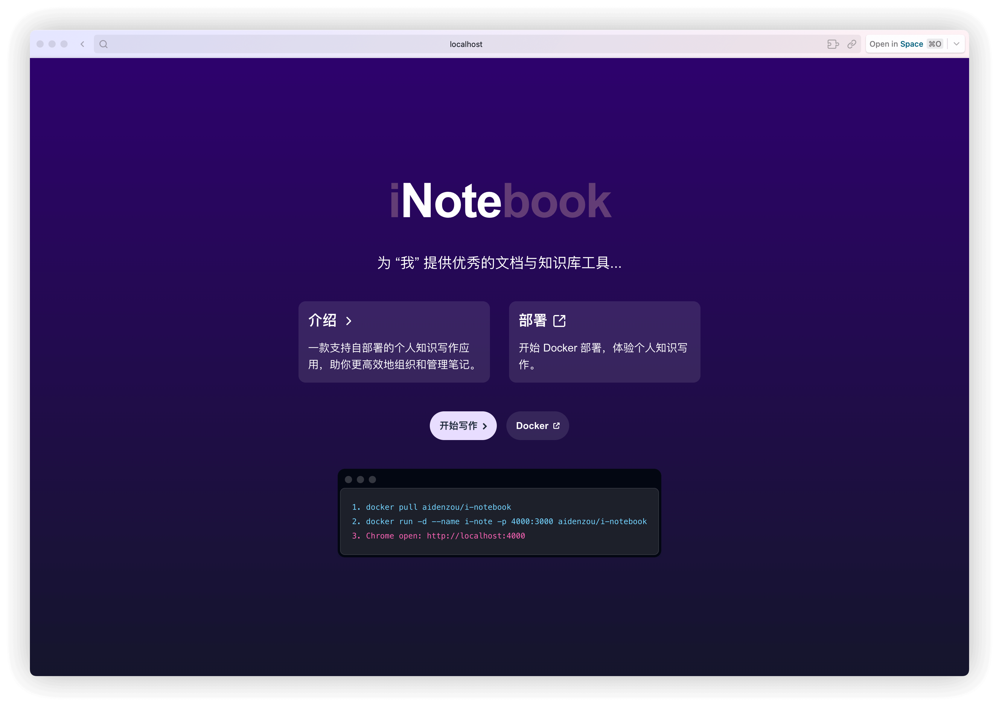
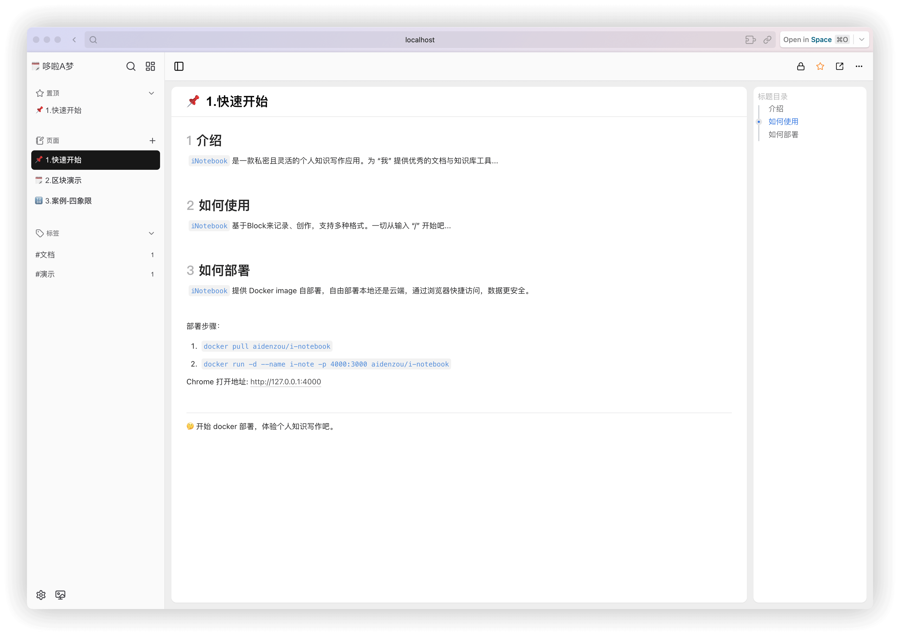
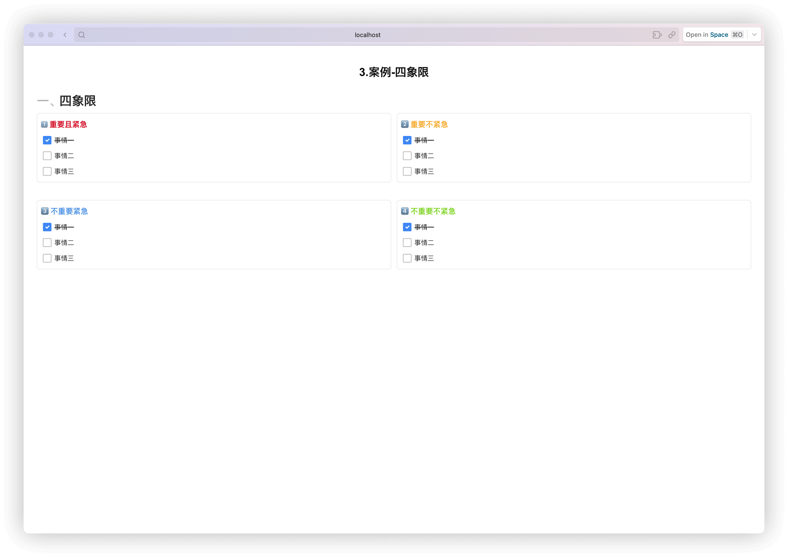
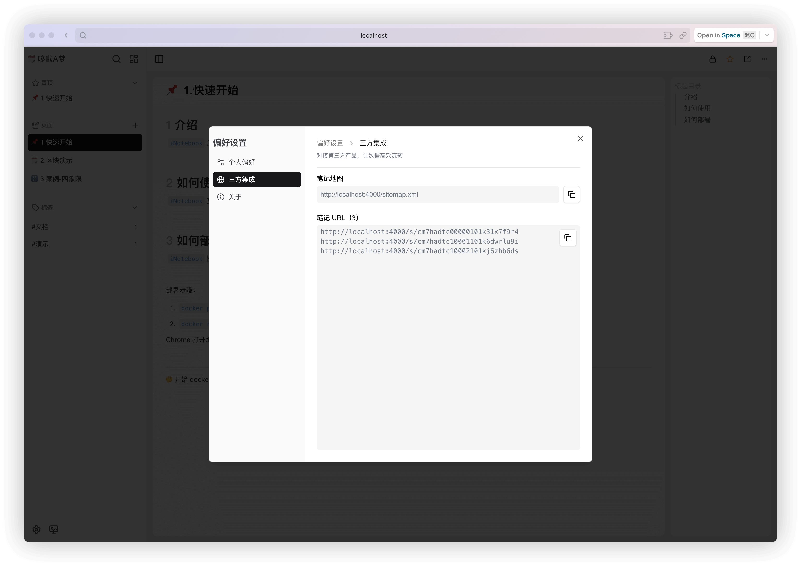
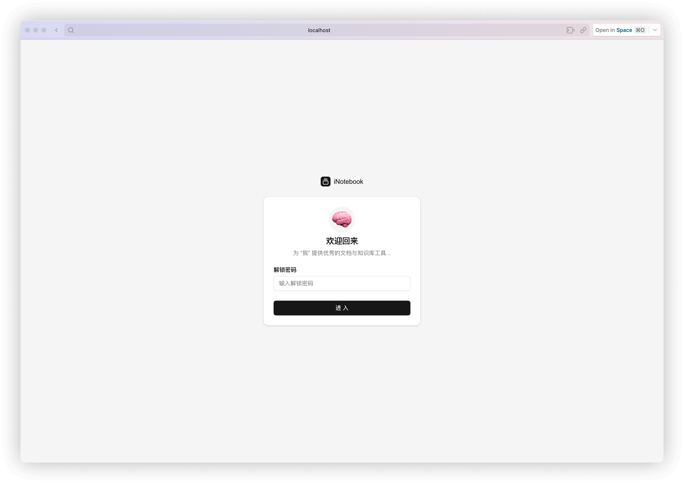

# iNotebook

一款支持自部署的个人知识写作应用，助你更高效地组织和管理笔记。

- iNotebook 在线沙盒体验：[https://inotebook-sandbox.vercel.app](https://inotebook-sandbox.vercel.app)
- iNotebook Docker Hub：[https://hub.docker.com/r/aidenzou/i-notebook](https://hub.docker.com/r/aidenzou/i-notebook)

## 功能描述

- 块编辑
- 编辑保护
- 标题自动编号
- 空行提示
- 标题目录
- 收藏置顶
- 自动标签
- 密码锁定
- 笔记地图
- 访问单篇笔记
- 导出导入
- 打印笔记 或 导出 PDF
- ...

除此之外，基于笔记地图对接第三方产品，让数据高效流转，快速搭建本地个人知识库

## 如何部署

Docker Hub：[iNotebook](https://hub.docker.com/r/aidenzou/i-notebook)

### Deploy

```shell
docker pull aidenzou/i-notebook
docker run -d --name i-note -p 4000:3000 aidenzou/i-notebook
```

Chrome open: [http://localhost:4000⁠](http://localhost:4000⁠)

### ENV

| 环境变量 | 描述 |
| ---- | ---- |
| DATABASE_PATH | sqlite 文件地址 |
| AUTH_UNLOCKCODE | 解锁密码 |
| SITE_URL | 部署后服务访问地址 |

## 功能演示






